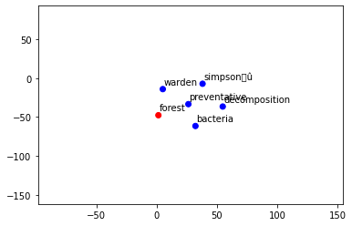
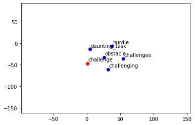

# **Preprocessing NLP - Tutoriel pour nettoyer rapidement un texte** - [voir l'article](https://inside-machinelearning.com/preprocessing-nlp-tutoriel-pour-nettoyer-rapidement-un-texte/)

Je vous propose aujourd'hui **un tutoriel de Preprocessing NLP** pour voir en détail **comment nettoyer des données textes !**
 
On va voir **plusieurs approches** qui seront adaptable autant aux **textes en anglais** qu'aux **textes en français**.
 
Ensuite, on verra comment **encoder ces données** en format compréhensible, **interprétable** par nos modèles de **Machine Learning et Deep Learning.**
 
**C'est parti !**

# **Preprocessing**

## **Charger les données**

**Premièrement**, comme à notre habitude, on va **charger nos données**.
 
Ici on prend un **fichier csv** tiré de [cette compétition Kaggle](https://www.kaggle.com/c/nlp-getting-started) contenant **plusieurs milliers de phrases en anglais.**
 
**Parfait pour nous ;)**

On charge les **phrases** depuis ce [répertoire Github](https://github.com/tkeldenich/NLP_Preprocessing).


```
!git clone https://github.com/tkeldenich/NLP_Preprocessing.git &> /dev/null
```

Puis on **insère ces données** dans un **Dataframe Pandas**.


```
import numpy as np
import pandas as pd

train_data = pd.read_csv('/content/NLP_Preprocessing/train.csv')

train_data.head()
```


<div>
<style scoped>
    .dataframe tbody tr th:only-of-type {
        vertical-align: middle;
    }

    .dataframe tbody tr th {
        vertical-align: top;
    }

    .dataframe thead th {
        text-align: right;
    }
</style>
<table border="1" class="dataframe">
  <thead>
    <tr style="text-align: right;">
      <th></th>
      <th>text</th>
    </tr>
  </thead>
  <tbody>
    <tr>
      <th>0</th>
      <td>Forest fire near La Ronge Sask. Canada</td>
    </tr>
    <tr>
      <th>1</th>
      <td>All residents asked to 'shelter in place' are ...</td>
    </tr>
    <tr>
      <th>2</th>
      <td>13,000 people receive #wildfires evacuation or...</td>
    </tr>
    <tr>
      <th>3</th>
      <td>Just got sent this photo from Ruby #Alaska as ...</td>
    </tr>
    <tr>
      <th>4</th>
      <td>#RockyFire Update =&gt; California Hwy. 20 closed...</td>
    </tr>
  </tbody>
</table>
</div>


## **Nettoyer les données**

Une fois que les **données sont chargées** il faut les **nettoyer**, faire ce qu'on appelle un **preprocessing**.
 
**Dans la plupart des cas pour du NLP**, le preprocessing consiste à **enlever les caractères** qui ne sont pas des lettres comme "#", "-", "!", les **chiffres** ou bien encore **les mots qui n'ont pas de sens** ou qui ne font pas partie de la langue analysée.
 
**Garder en tête** cependant que pour certains **type de problèmes** il peut être intéressant de **préserver certains types de caractères.**
 
Par exemple : pour analyser **si un email est un spam ou non**, on peut imaginer que **les '!' sont un bon indicateur** et donc **ne pas les enlever lors du nettoyage.**

Nous allons ici **coder deux fonctions :**
- une pour **nettoyer nos phrases en langue anglaise**
- une pour **nettoyer nos phrases en langue française**
 
Ces deux fonctions ont, par ailleurs, **la même architecture.**

### **Texte en anglais**

Premièrement on **importe** toutes les **librairies nécessaires :**


```
import nltk
import string
from nltk.stem import WordNetLemmatizer 

nltk.download('stopwords')
nltk.download('punkt')
nltk.download('words')
nltk.download('wordnet')
```

    [nltk_data] Downloading package stopwords to /root/nltk_data...
    [nltk_data]   Unzipping corpora/stopwords.zip.
    [nltk_data] Downloading package punkt to /root/nltk_data...
    [nltk_data]   Unzipping tokenizers/punkt.zip.
    [nltk_data] Downloading package words to /root/nltk_data...
    [nltk_data]   Unzipping corpora/words.zip.
    [nltk_data] Downloading package wordnet to /root/nltk_data...
    [nltk_data]   Unzipping corpora/wordnet.zip.

    True


Ensuite on **initialise** :
- les **stopwords**, ce sont les mots qui apparaissent très fréquemment mais qui n'apporte pas de sens à la phrase (comme "de", "le", "une")
- les mots (**words**) qui proviennent d'un dictionnaire **anglais**
- un **lemmatizer**, cette objet nous permet de préserver la racine des mots de tel sorte que deux mots ayant une même souche seront considérés comme un seul et même mot (exemple : 'voisine' et 'voisinage' seront tous deux changer en 'voisin')


```
stopwords = nltk.corpus.stopwords.words('english')
words = set(nltk.corpus.words.words())
lemmatizer = WordNetLemmatizer()
```

Puis on construit notre **fonction de preprocessing** qui va successivement :
- enlever la **ponctuation**
- enlever les **chiffres**
- transformer les phrases en **liste de tokens** (en liste de mots)
- enlever les **stopwords** (mots n'apportant pas de sens)
- **lemmatizer**
- enlever les **majuscules**
- **reformer les phrases** avec les mots restants


```
def Preprocess_listofSentence(listofSentence):
    preprocess_list = []
    for sentence in listofSentence :
        
        sentence_w_punct = "".join([i.lower() for i in sentence if i not in string.punctuation])
        
        sentence_w_num = ''.join(i for i in sentence_w_punct if not i.isdigit())

        tokenize_sentence = nltk.tokenize.word_tokenize(sentence_w_num)
        
        words_w_stopwords = [i for i in tokenize_sentence if i not in stopwords]
        
        words_lemmatize = (lemmatizer.lemmatize(w) for w in words_w_stopwords)

        sentence_clean = ' '.join(w for w in words_lemmatize if w.lower() in words or not w.isalpha())
        
        preprocess_list.append(sentence_clean)
    
    return preprocess_list 
```

Puis on l'**utilise :**


```
preprocess_list = Preprocess_listofSentence(train_data['text'])
```

Ensuite on peut **afficher** un exemple de **phrase nettoyée :**


```
print('Phrase de base : '+train_data['text'][2])
print('Phrase nettoyée : '+preprocess_list[2])
```

    Phrase de base : 13,000 people receive #wildfires evacuation orders in California 
    Phrase nettoyée : people receive wildfire evacuation order


### **Texte en français**

Ici on va d'abord installer **la librairie** [FrenchLefffLemmatizer](https://github.com/ClaudeCoulombe/FrenchLefffLemmatizer) qui permet d'effectuer une **lemmatization en français.**


```
 !pip install git+https://github.com/ClaudeCoulombe/FrenchLefffLemmatizer.git &> /dev/null
```

On **importe** ensuite les librairies.


```
import nltk
import string
from french_lefff_lemmatizer.french_lefff_lemmatizer import FrenchLefffLemmatizer
 
nltk.download('wordnet')
nltk.download('punkt')
nltk.download('stopwords')
```

    [nltk_data] Downloading package wordnet to /root/nltk_data...
    [nltk_data]   Package wordnet is already up-to-date!


    True


Ensuite on **initialise** :
- les **stopwords**, ce sont les mots qui apparaissent très fréquemment mais qui n'apporte pas de sens à la phrase (comme "de", "le", "une")
- les **mots** qui proviennent d'un dictionnaire **français**
- un **lemmatizer**, cette objet nous permet de préserver la racine des mots de tel sorte que deux mots ayant une même souche seront considérés comme un même mot (exemple : 'voisine' et 'voisinage' seront tous deux changer en 'voisin')


```
french_stopwords = nltk.corpus.stopwords.words('french')
mots = set(line.strip() for line in open('/content/NLP_Preprocessing/dictionnaire.txt'))
lemmatizer = FrenchLefffLemmatizer()
```

Puis on construit notre fonction de preprocessing qui va successivement :
- enlever la **ponctuation**
- enlever les **chiffres**
- transformer les phrases en **liste de tokens** (en liste de mots)
- enlever les **stopwords** (mots n'apportant pas de sens)
- **lemmatizer**
- garder seulement **les mots présent dans le dictionnaire**
- enlever les **majuscules**
- **reformer les phrases** avec les mots restant


```
def French_Preprocess_listofSentence(listofSentence):
  preprocess_list = []
  for sentence in listofSentence :
        
    sentence_w_punct = "".join([i.lower() for i in sentence if i not in string.punctuation])
        
    sentence_w_num = ''.join(i for i in sentence_w_punct if not i.isdigit())
 
    tokenize_sentence = nltk.tokenize.word_tokenize(sentence_w_num)
        
    words_w_stopwords = [i for i in tokenize_sentence if i not in french_stopwords]
        
    words_lemmatize = (lemmatizer.lemmatize(w) for w in words_w_stopwords)
 
    sentence_clean = ' '.join(w for w in words_lemmatize if w.lower() in mots or not w.isalpha())
        
    preprocess_list.append(sentence_clean)
    
  return preprocess_list
```

On crée des données pour **tester notre fonction :**


```
lst = ['C\'est un test pour lemmatizer',
       'plusieurs phrases pour un nettoyage',
       'eh voilà la troisième !']
french_text = pd.DataFrame(lst, columns =['text'])
```

Ensuite on l'**utilise :**


```
french_preprocess_list = French_Preprocess_listofSentence(french_text['text'])
```

Et on **regarde le résultat :**


```
print('Phrase de base : '+lst[1])
print('Phrase nettoyée : '+french_preprocess_list[1])
```

    Phrase de base : plusieurs phrases pour un nettoyage
    Phrase nettoyée : plusieurs phrase nettoyage


# **Les différents encodages**

Une fois qu'on a **extrait les informations utiles** de nos phrases, on peut passer à **la phase d'encodage.**
 
L'encodage est une **étape essentielle** pour pouvoir faire du **Machine Learning.**
 
En effet, il permet de **transformer les données texte en chiffres** que la machine peut interprérer, **que la machine peut comprendre**.
 
Il existe **différents types d'encodage** et nous allons dès maintenant aborder **les plus connus !**

## **One-Hot Encoding**

Le **One-Hot Encoding** est à la fois **la méthode la plus connu**, la **plus simple à réaliser**, et celle qui m'a permis d'avoir **la meilleure précision** dans la plupart de **mes travaux personnels en NLP.**
 
Le One-Hot consite à **créer un dictionnaire** avec **tous les mots qui apparaissent** dans nos phrases nettoyées.
 
Ce dictionnaire est en fait **un tableau** où **chaque colonne représente un mot** et **chaque ligne représente une phrase**.
 
Si **tel mot apparaît dans tel phrase**, on met une **valeur de 1** dans l'élément du tableau, **sinon** on met une **valeur de 0.**
 
On aura donc un **tableau composé uniquement de 0 et de 1**.

Pour réaliser le **One-Hot Encoding** en **Python**, on initialise le **dictionnaire** avec la fonction *CountVectorizer()* de la librairie *Sklearn*.
 
Puis on utilise la **fonction** *fit_transform()* sur **nos données preprocessées.**


```
from sklearn.feature_extraction.text import CountVectorizer
 
vectorizer = CountVectorizer()
 
X = vectorizer.fit_transform(preprocess_list)
```


```
X.toarray()[0]
```


    array([0, 0, 0, ..., 0, 0, 0])


En fait la **classe** *vectorizer* garde beaucoup d'autres **informations sur le dictionnaire.**
 
En outre, si nous voulons **encoder de nouvelles phrases** pour utiliser notre **modèle de Machine Learning entraîné** il faudra utiliser la **fonction** *fit()* de la **classe** *vectorizer*.
 
On peut ainsi **adapter ces nouvelles phrases à notre dictionnaire.** Cela implique néanmoins que si ces nouvelles phrases contiennent **un mot qui n'est pas dans le dictionnaire**, il ne sera **pas pris en compte.**
 
On peut voir **les mots composants ce dictionnaire** avec la **fonction**  *get_feature_names()* de *vectorizer*.


```
vectorizer.get_feature_names()
```


    ['aa',
     'aal',
     'aba',
     'abandon',
     'abandoned',
     'ability',
     'abject',
     'ablaze',
     'able',
     'aboard',
     'abomination',
     'abortion',
     'abouts',
     'absence',
     'absolute',
     'absolutely',
     'abstract',
     'absurd',
     'absurdly',
     'abuse',
     'accept',
     'access',
     'accident',
     'accidentally',
     'accidently',
     'accidents',
     'according',
     'accordingly',
     'account',
     'accountable',
     'accuracy',
     'accused',
     'accustomed',
     'ace',
     'achieve',
     'achievement',
     'aching',
     'acid',
     'acids',
     'acne',
     'acoustic',
     'acquiesce',
     'acquire',
     'acquired',
     'acquisition',
     'acre',
     'acronym',
     'across',
     'acrylic',
     'act',
     'actin',
     'acting',
     'action',
     'activate',
     'active',
     'actively',
     'activist',
     'activity',
     'actor',
     'actress',
     'actual',
     'actually',
     'acute',
     'ad',
     'adaptation',
     'add',
     'added',
     'addict',
     'addiction',
     'addition',
     'address',
     'adjust',
     'adjustable',
     'adjuster',
     'administration',
     'administrative',
     'admit',
     'adopt',
     'adoption',
     'adoptive',
     'adorable',
     'adult',
     'advance',
     'advanced',
     'advantage',
     'adventure',
     'adverse',
     'advertise',
     'advice',
     'advised',
     'advisory',
     'aeroplane',
     'aesthetic',
     'affair',
     'affect',
     'affected',
     'affecting',
     'affiliate',
     'affiliation',
     'affliction',
     'afloat',
     'afraid',
     'afterhours',
     'afterlife',
     'aftermath',
     'afternoon',
     'aftershock',
     'afterwards',
     'agalloch',
     'age',
     'agency',
     'agent',
     'aggression',
     'aggressive',
     'aggressively',
     'agnus',
     'ago',
     'agony',
     'agree',
     'agreed',
     'agreement',
     'ah',
     'ahead',
     'ai',
     'aid',
     'aim',
     'aimlessly',
     'aint',
     'air',
     'aircraft',
     'airhead',
     'airing',
     'airlift',
     'airplane',
     'airport',
     'aisle',
     'ak',
     'aka',
     'al',
     'ala',
     'alameda',
     'alarm',
     'alarmed',
     'alarming',
     'alarmingly',
     'alaska',
     'alba',
     'albeit',
     'album',
     'alchemist',
     'alcohol',
     'alec',
     'alert',
     'algae',
     'alien',
     'align',
     'alive',
     'allay',
     'allegation',
     'allegedly',
     'allegiance',
     'allergic',
     'alley',
     'alliance',
     'allied',
     'alloosh',
     'allotment',
     'allow',
     'alloy',
     'ally',
     'almighty',
     'almost',
     'alone',
     'along',
     'alp',
     'alpha',
     'already',
     'alright',
     'alrighty',
     'also',
     'alt',
     'alternate',
     'alternative',
     'although',
     'aluminum',
     'always',
     'ama',
     'amateur',
     'amazed',
     'amazing',
     'amazon',
     'amber',
     'ambition',
     'ambulance',
     'amen',
     'amends',
     'america',
     'amid',
     'amino',
     'amman',
     'among',
     'amongst',
     'amplifier',
     'an',
     'ana',
     'analysis',
     'anarchy',
     'anatomy',
     'anchor',
     'anchorage',
     'ancient',
     'and',
     'android',
     'anew',
     'angel',
     'angelriveralib',
     'anger',
     'angioplasty',
     'angry',
     'ani',
     'animal',
     'animation',
     'anime',
     'ankle',
     'anna',
     'annihilate',
     'annihilation',
     'anniversary',
     'announce',
     'announcement',
     'annoying',
     'annual',
     'anonymous',
     'another',
     'answer',
     'ant',
     'ante',
     'anthelmintic',
     'anthology',
     'anthrax',
     'anti',
     'antichrist',
     'antifeminist',
     'anxiety',
     'anxious',
     'anybody',
     'anyone',
     'anything',
     'anyway',
     'anyways',
     'anywhere',
     'apart',
     'apartment',
     'apiece',
     'apocalypse',
     'apocalyptic',
     'apologize',
     'apology',
     'appalling',
     'apparent',
     'apparently',
     'appeal',
     'appease',
     'apperception',
     'appetite',
     'applaud',
     'apple',
     'application',
     'applied',
     'apply',
     'appointment',
     'appraisal',
     'appreciate',
     'approach',
     'approaching',
     'appropriate',
     'appropriation',
     'approval',
     'apropos',
     'apt',
     'aquarium',
     'ar',
     'ara',
     'arcade',
     'archetype',
     'architect',
     'architecture',
     'are',
     'area',
     'areal',
     'aren',
     'arena',
     'arent',
     'argue',
     'argument',
     'ari',
     'ariz',
     'arm',
     'armed',
     'armory',
     'army',
     'around',
     'arrest',
     'arrival',
     'arrive',
     'arrogant',
     'arse',
     'arsenal',
     'arson',
     'arsonist',
     'art',
     'article',
     'artificial',
     'artillery',
     'artist',
     'ary',
     'as',
     'ascend',
     'ash',
     'aside',
     'ask',
     'asleep',
     'aspect',
     'asphalt',
     'aspiring',
     'ass',
     'assailant',
     'assassins',
     'assault',
     'assembly',
     'assertative',
     'assessment',
     'asset',
     'assistance',
     'assistant',
     'associated',
     'association',
     'assume',
     'assured',
     'astonishing',
     'astounding',
     'astrakhan',
     'astrologian',
     'astrology',
     'asylum',
     'at',
     'ate',
     'atheistic',
     'athlete',
     'athletics',
     'atlantic',
     'atlas',
     'atmosphere',
     'atmospheric',
     'atom',
     'atomic',
     'attached',
     'attack',
     'attempt',
     'attend',
     'attendance',
     'attention',
     'attic',
     'attitude',
     'attraction',
     'attractive',
     'auburn',
     'auction',
     'audience',
     'audio',
     'audit',
     'august',
     'aunt',
     'aurora',
     'australia',
     'authentic',
     'author',
     'authority',
     'autism',
     'autistic',
     'auto',
     'autobiography',
     'automatic',
     'autumn',
     'ava',
     'available',
     'avalanche',
     'ave',
     'avenger',
     'avenue',
     'average',
     'avert',
     'averted',
     'aviation',
     'avoid',
     'aw',
     'await',
     'awake',
     'awakening',
     'award',
     'aware',
     'awareness',
     'awash',
     'away',
     'awesome',
     'awful',
     'awkward',
     'awn',
     'ay',
     'ba',
     'babe',
     'baby',
     'back',
     'background',
     'backing',
     'backlash',
     'backup',
     'bacteria',
     'bad',
     'badge',
     'badges',
     'badly',
     'badu',
     'bae',
     'baffle',
     'baffling',
     'bag',
     'baggage',
     'bagged',
     'bagging',
     'bago',
     'bags',
     'bah',
     'bail',
     'bait',
     'bake',
     'baked',
     'baking',
     'bal',
     'balance',
     'balcony',
     'bali',
     'ball',
     'ban',
     'banana',
     'band',
     'bang',
     'bank',
     'banking',
     'bannister',
     'banquet',
     'bar',
     'barbaric',
     'barber',
     'barcelona',
     'bard',
     'bardo',
     'bare',
     'barely',
     'bargain',
     'bark',
     'barking',
     'barn',
     'barra',
     'barrack',
     'barrier',
     'barring',
     'barry',
     'bartender',
     'basalt',
     'base',
     'baseball',
     'based',
     'baseman',
     'basement',
     'bash',
     'basic',
     'basically',
     'basis',
     'bask',
     'basket',
     'bass',
     'bastard',
     'bat',
     'bath',
     'bathe',
     'bathroom',
     'batter',
     'battered',
     'battery',
     'batting',
     'battle',
     'battlefield',
     'battleship',
     'bay',
     'bayonet',
     'be',
     'beach',
     'beached',
     'beacon',
     'beam',
     'bean',
     'bear',
     'beard',
     'beast',
     'beastly',
     'beat',
     'beaten',
     'beating',
     'beautiful',
     'beautifully',
     'beauty',
     'beckoning',
     'become',
     'becomes',
     'becoming',
     'bed',
     'bedding',
     'bedroom',
     'bee',
     'beef',
     'beer',
     'beet',
     'beetroot',
     'begging',
     'begin',
     'beginner',
     'beginning',
     'begun',
     'behalf',
     'behavior',
     'behaviour',
     'behead',
     'behind',
     'behold',
     'beige',
     'belie',
     'belief',
     'believe',
     'believing',
     'bell',
     'belle',
     'belligerent',
     'belly',
     'belt',
     'belter',
     'beluga',
     'ben',
     'bend',
     'bene',
     'beneath',
     'benedict',
     'benediction',
     'benefit',
     'benjamin',
     'berlin',
     'berry',
     'beside',
     'besides',
     'besieged',
     'best',
     'bet',
     'beth',
     'better',
     'betting',
     'beware',
     'beyond',
     'bias',
     'bicentennial',
     'bicycle',
     'bicyclist',
     'bid',
     'big',
     'bigamist',
     'bigger',
     'biggest',
     'bike',
     'bilic',
     'bilingual',
     'bill',
     'billboard',
     'billing',
     'billion',
     'billionaire',
     'billy',
     'bin',
     'bind',
     'biological',
     'bioter',
     'bird',
     'birth',
     'birthday',
     'bistro',
     'bit',
     'bitch',
     'bite',
     'biting',
     'bitten',
     'bitter',
     'biz',
     'black',
     'blackberry',
     'blacken',
     'blackmail',
     'blah',
     'blake',
     'blame',
     'blamed',
     'blaming',
     'bland',
     'blanket',
     'blast',
     'blasting',
     'blaze',
     'blazing',
     'bleacher',
     'bleed',
     'bleeding',
     'blending',
     'bless',
     'blessed',
     'blessing',
     'blight',
     'blind',
     'blink',
     'blinked',
     'blinker',
     'bliss',
     'blitz',
     'blizzard',
     'block',
     'blockage',
     'blocked',
     'blocking',
     'bloke',
     'blonde',
     'blood',
     'bloody',
     'bloom',
     'blossom',
     'blow',
     'blower',
     'blowing',
     'blown',
     'blowout',
     'blubber',
     'blue',
     'bluebell',
     'blueprint',
     'bluff',
     'blunt',
     'bn',
     'bo',
     'board',
     'boarding',
     'boasting',
     'boat',
     'bob',
     'bobble',
     'bobcat',
     'bod',
     'bodied',
     'body',
     'bolster',
     'bolt',
     'bomb',
     'bombed',
     'bomber',
     'bon',
     'bone',
     'bong',
     'bonsai',
     'bonus',
     'boob',
     'book',
     'bookmobile',
     'boom',
     'boost',
     'boot',
     'booth',
     'booty',
     'booze',
     'border',
     'borderland',
     'bore',
     'boring',
     'born',
     'borrower',
     'boston',
     'bot',
     'bother',
     'bottle',
     'bottling',
     'bottom',
     'bought',
     'boulder',
     'bounce',
     'bound',
     'boundary',
     'bounty',
     'bout',
     'bovine',
     'bow',
     'bowe',
     'bowery',
     'bowknot',
     'bowl',
     'bowling',
     'box',
     'boxer',
     'boxing',
     'boy',
     'brace',
     'bracelet',
     'bracing',
     'bracket',
     'brain',
     'brainless',
     'brake',
     'branch',
     'brand',
     'brant',
     'brass',
     'brasswork',
     'brave',
     'bravery',
     'brazil',
     'breach',
     'bread',
     'break',
     'breakdown',
     'breakfast',
     'breaking',
     'breast',
     'breath',
     'breathe',
     'breathing',
     'bred',
     'breed',
     'breeder',
     'brewer',
     'brewing',
     'brick',
     'bridal',
     'bride',
     'bridge',
     'bridgework',
     'brief',
     'briefing',
     'brig',
     'brigade',
     'bright',
     'brightening',
     'brightly',
     'brilliant',
     'bring',
     'brisk',
     'brit',
     'british',
     'broad',
     'broadcast',
     'broadly',
     'broadway',
     'brochure',
     'brock',
     'broke',
     'broken',
     'brother',
     'brought',
     'brown',
     'browner',
     'brownie',
     'browser',
     'browsing',
     'bruise',
     'brunette',
     'brunt',
     'brush',
     'brut',
     'brutal',
     'brutality',
     'brutally',
     'bu',
     'bubble',
     'buck',
     'buckle',
     'bud',
     'buddy',
     'budget',
     'buff',
     'buffalo',
     'buffer',
     'buffet',
     'bug',
     'build',
     'builder',
     'building',
     'buildings',
     'buildup',
     'built',
     'bull',
     'bullet',
     'bulletin',
     'bulletproof',
     'bullets',
     'bully',
     'bummer',
     'bump',
     'bumper',
     'bunch',
     'bundle',
     'bundy',
     'bunting',
     'burglar',
     'burglary',
     'buried',
     'burn',
     'burned',
     'burner',
     'burning',
     'burnt',
     'burp',
     'burst',
     'burton',
     'bury',
     'bus',
     'bush',
     'business',
     'businessman',
     'bust',
     'busted',
     'busy',
     'butch',
     'butt',
     'butter',
     'button',
     'buy',
     'by',
     'bye',
     'bypass',
     'ca',
     'cab',
     'cabbage',
     'cabin',
     'cable',
     'cabling',
     'cachet',
     'cafì',
     'cage',
     'cain',
     'cake',
     'cal',
     'calais',
     'calamity',
     'call',
     'calling',
     'calm',
     'calmly',
     'calorie',
     'calumet',
     'cam',
     'came',
     'cameo',
     'camera',
     'camilla',
     'camp',
     'campaign',
     'camper',
     'campfire',
     'campground',
     'campus',
     'can',
     'canada',
     'canal',
     'cancel',
     'cancer',
     'candidate',
     'candle',
     'candy',
     'cannibalism',
     'cannon',
     'canoe',
     'cant',
     'cantar',
     'canvas',
     'canyon',
     'cap',
     'capable',
     'capacity',
     'cape',
     'capital',
     'capitalism',
     'capitalist',
     'capitulation',
     'capsize',
     'captain',
     'caption',
     'captive',
     'captivity',
     'captor',
     'capture',
     'car',
     'caravan',
     'carcinoma',
     'card',
     'cardboard',
     'care',
     'careen',
     'career',
     'careful',
     'carefully',
     'careless',
     'carful',
     'cargo',
     'carl',
     'carnage',
     'caroline',
     'carpet',
     'carr',
     'carriage',
     'carried',
     'carry',
     'carrying',
     'cart',
     'cartel',
     'cartoon',
     'cartridge',
     'cascade',
     'case',
     'cash',
     'casing',
     'casino',
     'cast',
     'casting',
     'castle',
     'casual',
     'casually',
     'casualties',
     'casualty',
     'cat',
     'cataclysmic',
     'catalogue',
     'catastrophe',
     'catastrophic',
     'catch',
     'catcher',
     'catching',
     'catechize',
     'catfish',
     'caught',
     'causation',
     'cause',
     'causing',
     'caution',
     'cautious',
     'cave',
     'ce',
     'cee',
     'celebration',
     'celebrity',
     'celestial',
     'cell',
     'cement',
     'censor',
     'censorship',
     'census',
     'center',
     'centipede',
     'central',
     'cereal',
     'cern',
     'cerography',
     'certain',
     'certainly',
     'certainty',
     'certificate',
     'certified',
     'cervix',
     'cest',
     'chain',
     'chair',
     'chairman',
     'challenge',
     'champ',
     'champagne',
     'champaign',
     'champion',
     'championship',
     'chance',
     'change',
     'channel',
     'chaos',
     'chapter',
     'character',
     'charcoal',
     'charge',
     'charger',
     'charging',
     'charity',
     'charming',
     ...]


Le seul **inconvénient du One-Hot Encoding** c'est que l'on **perd la hiérarchie**, l'ordre des mots.
 
Cela nous fait donc **perdre** le contexte, **le sens de la phrase** et en théorie cela devrait appauvrir les résultats de notre modèle.
 
En pratique, cela est bien différent, on peut avoir des **résultats avec 80-85% de précision** ce qui est déjà **très intéressant pour du NLP !**

## **Word embeddings**

### **Encodage Hiérarchique**

Ici on utilise un **autre type** d'encodage: **l'encodage hiérarchique.**
 
Contrairement au One-Hot Encoding, vous vous en doutez, **on garde la hiérarchie**, l'ordre des mots et donc **le sens de la phrase.**
 
On a un **autre type de dictionnaire** ici. En fait, **chaque mot est représenté par un chiffre.**
 
Chaque **phrase** sera donc **une suite de chiffres.**
 
Un **exemple** sera plus parlant :
- "je joue au jeu vidéo" sera [1, 2, 3, 4, 5]
- "je regarde une vidéo" sera [1, 6, 7, 5]

Pour **cet endoge** on importe la **bibliothèque** *zeugma*. Si on est sur **Google Colab** on utilise la **commande suivante** :


```
!pip install zeugma &> /dev/null
```

Sinon on exécute cette **même commande**, sans le "!" du début, dans le **terminal**.
 
Ensuite, le fonctionnement est à peu près **le même que pour le one-hot encoding** : on utilise la fonction *TextsToSequences()*  pour **créer notre dictionnaire.**
 
Puis on utilise la **fonction** *fit_transform()* sur **nos phrases preprocessées.**


```
from zeugma import TextsToSequences
 
sequencer = TextsToSequences()
embedded_sequ = sequencer.fit_transform(preprocess_list)
```

    /usr/local/lib/python3.7/dist-packages/zeugma/keras_transformers.py:33: VisibleDeprecationWarning: Creating an ndarray from ragged nested sequences (which is a list-or-tuple of lists-or-tuples-or ndarrays with different lengths or shapes) is deprecated. If you meant to do this, you must specify 'dtype=object' when creating the ndarray
      return np.array(self.texts_to_sequences(texts))


Un exemple de phrase avec **l'encodage hiérarchique :**


```
embedded_sequ[0]
```


    [95, 1, 135, 434, 874]


Une dernière chose à faire : **normaliser nos données.**
 
Ehh oui, pour utiliser du **Machine Learning** il faut que nos données soit en **format tenseur.**
 
Cela implique qu'il faut que **toutes les phrases encodées aient la même taille.**
 
Pour que **nos phrases aient la même taille**, on a ici deux choix:
- **ajouter du 'vide'** aux phrases les plus courtes
- **tronquer les phrases** les plus longues
 
Pour ces deux choix, **une même fonction existe :** *sequence.pad_sequences()*
 
Elle possède **deux paramètres :**
- **sentences** la liste de phrases à remplir/tronquer
- **maxlen** la longueur finale que chaque phrase aura
 
En fait cette fonction **tronque les phrases** ayant une **longueur supérieur** à maxlen et **remplit de 0 les phrases** ayant une **longueur inférieur** à maxlen.


```
from keras.preprocessing import sequence
max_len = 40
 
pad_sequ = sequence.pad_sequences(embedded_sequ, maxlen=max_len)
```

On peut **afficher** une phrase encodée pour voir le **résultat** :


```
print(pad_sequ[0])
```

    [  0   0   0   0   0   0   0   0   0   0   0   0   0   0   0   0   0   0
       0   0   0   0   0   0   0   0   0   0   0   0   0   0   0   0   0  95
       1 135 434 874]


### **Couche Embedding**

En fait, l'**encodage hiérarchique** est un préalable pour utiliser la **couche** *Embedding* de **Keras**.
 
Cette couche permet de **donner des coordonnées** à tous les **mots de notre dictionnaire** tout en réalisant un **apprentissage**.
 
L'idée est que **plus les mots ont un sens proche**, **plus les mots ont des coordonnées proches.**
 
**La couche** va donc **s'améliorer**, comme toutes les autres couches, **au cours de l'apprentissage.** Ainsi à la fin de l'apprentissage, la couche aura donné **des coordonnées précises** pour chacun des mots.

La couche *Embedding* a **trois paramètres:**
- **input_dim**, le nombre de mots dans notre dictionnaire + 1
- **output_dim**, la dimension du tenseur de sortie
- **input_length**, la longueur des vecteurs (longueur des phrases normalisé)


```
longueur_dict = max(list(map(lambda x: max(x), pad_sequ)))+1
```


```
from keras.models import Sequential
from keras.layers import Embedding, Flatten, Dense

model = Sequential()
model.add(Embedding(longueur_dict, 8, input_length = max_len))
model.add(Flatten())
model.add(Dense(1, activation='sigmoid'))

model.summary()
```

    Model: "sequential"
    _________________________________________________________________
    Layer (type)                 Output Shape              Param #   
    =================================================================
    embedding (Embedding)        (None, 40, 8)             56520     
    _________________________________________________________________
    flatten (Flatten)            (None, 320)               0         
    _________________________________________________________________
    dense (Dense)                (None, 1)                 321       
    =================================================================
    Total params: 56,841
    Trainable params: 56,841
    Non-trainable params: 0
    _________________________________________________________________


On pourra ensuite **lancer l'entraînement** avec la fonction *fit()* puis **utiliser notre modèle !**

# **Pour aller plus loin...**

## **Word2Vec Embedding**

### **Entraînement**

Il existe **différentes librairies** pour faire de l'**embedding**.
 
**Keras** est particulièrement utile pour cette tâche car elle permet d'**entraîner l'embedding en même temps que le modèle de Deep Learning**.
 
La **librairie Gensim** est au moins aussi intéressante que Keras car elle nous permet de **visualiser cet embedding**.
 
C'est-à-dire qu'on va pouvoir **analyser l'embedding** en regardant **quel mot est similaire à quel autre** par exemple.

Pour cet **embedding**, il faut que **nos données** soient **sous forme de tokens** (chaque mot séparé) et non sous forme de phrases.


```
tokenize_sentences = []

for i in range(len(preprocess_list)):
  tokenize_sentences.append(nltk.tokenize.word_tokenize(preprocess_list[i]))
```

Ensuite, on utilise **la fonction** *Word2Vec* de la **librairie** *Gensim*.
 
Cette fonction possède **cinq paramètres principaux** :
- **size :** La dimension du vecteur créé, idéalement inférieur au nombre de mots du vocabulaire
 
- **fenêtre :** La distance maximale entre un mot cible et les mots autour du mot cible. La fenêtre par défaut est de 5.
 
- **min_count :** Le nombre minimum de mots à prendre en compte lors de l'apprentissage du modèle ; les mots dont l'occurrence est inférieure à ce nombre seront ignorés. La valeur par défaut de min_count est 5.
 
- **worker :** Le nombre de lots créés pour l'entraînement, par défaut il y en a 3.
 
Premièrement on **initialise le Word2Vec**, puis on l'**entraîne sur nos données** !


```
from gensim.test.utils import common_texts
from gensim.models import Word2Vec

model_W2V = Word2Vec(sentences=tokenize_sentences, size=100, window=5, min_count=1, workers=4)
model_W2V.train(tokenize_sentences, total_examples=len(tokenize_sentences), epochs=50)
```


    (2479234, 2527700)


### **Visualisation**

Le **modèle a appris** la similarité des mots **en fonction du contexte de nos phrases**.

Le **titre de notre jeu de données** est *'Disaster Tweet'* - *'Les tweets parlant de catastrophes(naturelles ou non)'*
 
 On peut par exemple **regarder quel mot se rapproche de 'fire'** grâce à la fonction *similar_by_word()*.


```
tokenize_sentences[0][1]
```


    'fire'


```
model_W2V.similar_by_word(tokenize_sentences[0][1])[:5]
```

    /usr/local/lib/python3.7/dist-packages/ipykernel_launcher.py:1: DeprecationWarning: Call to deprecated `similar_by_word` (Method will be removed in 4.0.0, use self.wv.similar_by_word() instead).
      """Entry point for launching an IPython kernel.


    [('township', 0.7251554727554321),
     ('spreading', 0.7012003660202026),
     ('alarm', 0.6951850652694702),
     ('warden', 0.6813154220581055),
     ('acre', 0.6741729974746704)]


Les **cinq premiers** sont *'decomposition'*, *'township'*, *'racer'*, *'beast'* et *'apartment'*.
 
Cela veut dire que **la plupart du temps**, *'fire'* à été **utilisé au côté de ces mots**.

Pour mieux **visualiser cette similarité** on peut utiliser **la fonction suivante** :


```
from sklearn.manifold import TSNE
from matplotlib import pyplot as plt

def display_closestwords_tsnescatterplot_perso(model, word):
    
    arr = np.empty((0,100), dtype='f')
    word_labels = [word]

    numb_sim_words = 5

    # get close words
    close_words = model.similar_by_word(word)[:numb_sim_words]
    
    # add the vector for each of the closest words to the array
    arr = np.append(arr, np.array([model[word]]), axis=0)
    for wrd_score in close_words:
        wrd_vector = model[wrd_score[0]]
        word_labels.append(wrd_score[0])
        arr = np.append(arr, np.array([wrd_vector]), axis=0)
        
    # find tsne coords for 2 dimensions
    tsne = TSNE(n_components=2, random_state=0)
    np.set_printoptions(suppress=True)
    Y = tsne.fit_transform(arr)

    x_coords = Y[:, 0]
    y_coords = Y[:, 1]

    # color for words
    color = ['red']
    for i in range(numb_sim_words):
      color.append('blue')
     
    # display scatter plot
    plt.scatter(x_coords, y_coords, c = color)

    for label, x, y in zip(word_labels, x_coords, y_coords):
        plt.annotate(label, xy=(x, y), xytext=(1, 5), textcoords='offset points')
    plt.xlim(min(x_coords)-100, max(x_coords)+100)
    plt.ylim(min(y_coords)-100, max(y_coords)+100)
    plt.show()
    print("Word most similar to : "+word)
    print([sim_word[0] for sim_word in close_words])
```

Et ensuite l'utiliser **en précisant le modèle d'Embedding** et **le mot à analyser** :


```
display_closestwords_tsnescatterplot_perso(model_W2V, tokenize_sentences[0][0])
```

    /usr/local/lib/python3.7/dist-packages/ipykernel_launcher.py:12: DeprecationWarning: Call to deprecated `similar_by_word` (Method will be removed in 4.0.0, use self.wv.similar_by_word() instead).
      if sys.path[0] == '':
    /usr/local/lib/python3.7/dist-packages/ipykernel_launcher.py:15: DeprecationWarning: Call to deprecated `__getitem__` (Method will be removed in 4.0.0, use self.wv.__getitem__() instead).
      from ipykernel import kernelapp as app
    /usr/local/lib/python3.7/dist-packages/ipykernel_launcher.py:17: DeprecationWarning: Call to deprecated `__getitem__` (Method will be removed in 4.0.0, use self.wv.__getitem__() instead).
    /usr/local/lib/python3.7/dist-packages/matplotlib/backends/backend_agg.py:214: RuntimeWarning: Glyph 137 missing from current font.
      font.set_text(s, 0.0, flags=flags)
    /usr/local/lib/python3.7/dist-packages/matplotlib/backends/backend_agg.py:183: RuntimeWarning: Glyph 137 missing from current font.
      font.set_text(s, 0, flags=flags)


    

    


    Word most similar to : forest
    ['decomposition', 'bacteria', 'warden', 'preventative', 'simpson\x89û']


**L'inconvénient de Word2vec** c'est qu'il apprend le sens d'un mot **uniquement en fonction des mots qui l'entourent**, là où **Keras**  apprend **le sens des mots en fonction de l'objectif** (y_train) fixé lors de l'apprentissage.
 
En fait, *Word2Vec* a une **approche non-supervisée** et *Keras* une **approche supervisée**.

## **Word2Vec Pré-entraîné par Google**

**Une autre approche** consiste à prendre un **Word2Vec déjà entraîné**.

**Google** et **Facebook** propose le leur qui, vous l'imaginait bien, a été **entraîné sur des millions (milliards ?) de données !**

Idéal pour avoir une **représentation générale du vocabulaire d'une langue.**

**À savoir cependant**, les Word2Vec entraînés par Facebook, Google, ou autre **ne peuvent pas être adaptés**, **entraînés sur nos phrases**. On peut seulement **les utiliser en gardant le contexte général** sur lequel ils ont été entraîné.

On télécharge ici le **Word2Vec entraîné par Google** (1.5GB) (disponible sur [ce lien](https://drive.google.com/file/d/0B7XkCwpI5KDYNlNUTTlSS21pQmM/edit) si vous voulez le télécharger en local) :


```
!wget -q --show-progress --load-cookies /tmp/cookies.txt "https://docs.google.com/uc?export=download&confirm=$(wget --quiet --save-cookies /tmp/cookies.txt --keep-session-cookies --no-check-certificate 'https://docs.google.com/uc?export=download&id=0B7XkCwpI5KDYNlNUTTlSS21pQmM' -O- | sed -rn 's/.*confirm=([0-9A-Za-z_]+).*/\1\n/p')&id=0B7XkCwpI5KDYNlNUTTlSS21pQmM" -O word2vec_pretrained.bin.gz && rm -rf /tmp/cookies.txt

```

    word2vec_pretrained     [               <=>  ]   1.53G   112MB/s    in 13s     


Ensuite on utilise la **bibliothèque** *sh* pour le **dézipper**.


```
!pip install sh &> /dev/null
```

On le **dézip :**


```
from sh import gunzip

gunzip('/content/word2vec_pretrained.bin.gz')
```


    


Puis on utilise la **fonction** *load_word2vec_format()* de la class *KeyedVectors* pour **charger le Word2vec de Google.**


```
from gensim.models import KeyedVectors

model = KeyedVectors.load_word2vec_format('/content/word2vec_pretrained.bin', binary=True)  
```

On peut ensuite **l'utiliser** avec un **modèle de Deep Learning**..
 
Je vous propose ici d'**explorer la représentation du modèle**, les liens qu'il fait entre les mots ...
 
On peut par exemple **regarder les mots similaires** à *'koala'* on obtient *'koalas'*, *'wombat'*, *'quoll'*, *'orang_utan'*, *'Koala'*.


```
model.similar_by_word('koala')[:5]
```


    [('koalas', 0.7420616745948792),
     ('wombat', 0.6323026418685913),
     ('quoll', 0.6266179084777832),
     ('orang_utan', 0.6036992073059082),
     ('Koala', 0.5906292200088501)]


Ou **comparer la similarité** entre **deux mots** :


```
model.similarity('hotdog', 'hamburger')
```


    0.65520716


Ou encore utiliser **notre fonction** de tout à l'heure pour une **visualisation plus concrète**.


```
from sklearn.manifold import TSNE
from matplotlib import pyplot as plt
import numpy as np

def display_closestwords_tsnescatterplot(model, word):
    
    arr = np.empty((0,300), dtype='f')
    word_labels = [word]

    numb_sim_words = 5

    # get close words
    close_words = model.similar_by_word(word)[:numb_sim_words]
    
    # add the vector for each of the closest words to the array
    arr = np.append(arr, np.array([model[word]]), axis=0)
    for wrd_score in close_words:
        wrd_vector = model[wrd_score[0]]
        word_labels.append(wrd_score[0])
        arr = np.append(arr, np.array([wrd_vector]), axis=0)
        
    # find tsne coords for 2 dimensions
    tsne = TSNE(n_components=2, random_state=0)
    np.set_printoptions(suppress=True)
    Y = tsne.fit_transform(arr)

    x_coords = Y[:, 0]
    y_coords = Y[:, 1]

    # color for words
    color = ['red']
    for i in range(numb_sim_words):
      color.append('blue')
     
    # display scatter plot
    plt.scatter(x_coords, y_coords, c = color)

    for label, x, y in zip(word_labels, x_coords, y_coords):
        plt.annotate(label, xy=(x, y), xytext=(1, 5), textcoords='offset points')
    plt.xlim(min(x_coords)-100, max(x_coords)+100)
    plt.ylim(min(y_coords)-100, max(y_coords)+100)
    plt.show()
```


```
display_closestwords_tsnescatterplot(model, 'challenge')
```


    

    


Avec ces **connaissances**, vous devriez **avoir les outils en main** pour **entraîner vos propres modèles** de NLP ou **améliorer vos modèles** déjà entraînés.
 
Si vous voulez en savoir plus sur **les modèles NLP de Machine Learning** n'hésitez pas à voir [nos autres articles sur le sujet !](https://inside-machinelearning.com/un-modele-classification-binaire-en-nlp/)
